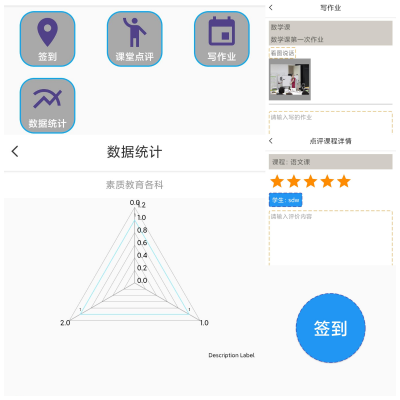
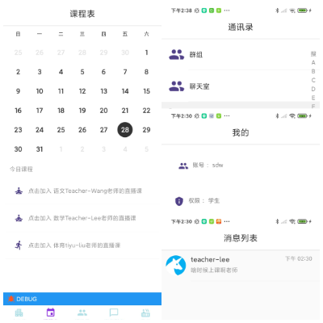
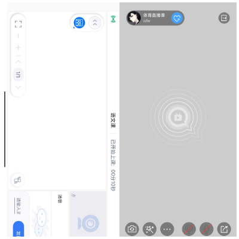
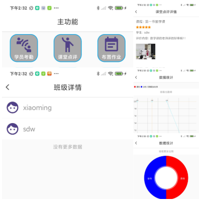
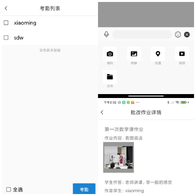

# 教学助手
----

开发环境：
- Tools : Android Studio 4.1.2
- os : windows 10
- code : kotlin			

配置文件：

- appId 目录	 com.kangaroo.studentedu.app.appId
- appCe(证书) 目录	 com.kangaroo.studentedu.app.appCe

运行环境：

- os : Android 5.0 +

项目包含内容：

- Android project
- 安装包

第三方：

- 声网灵动课堂 sdk
- 声网直播 sdk
- 环信IM sdk

## 项目背景
疫情期间在线教育火了，各种直播教育软件都开始推广。教育软件开始了火热。就拿我公司来说，我公司是数据化教育行业的一员。在疫情期间帮助学校进行了作业发布，作业批改的业务，帮助学校提升了疫情期间的教学质量。
就拿普通中小学来举例：
互动白板功能非常重要，老师上课会用互动白板功能，老师录课也会用互动白板功能。除了上课和录课，老师还可以通过设备来下发电子考题，考试题目。考试完毕后还可以统计到本堂课的上课质量。
- 拿一些特殊课堂举例：
艺术课，体育课，音乐课等，这些课堂有时可能不需要白板这样的功能，互动直播功能又变得比较适合。
- 拿一些校外辅导举例：
校外辅导的校长需要了解当前学校老师教学情况的数据，了解学生上课的数据，了解学校招生的数据。通过这些数据来提升学校的应受。
## 运行说明
本项目登录功能全部采用环信sdk提供的登录功能呢，支持单设备登录，互踢功能。
由于本项目没有后台，很多功能和数据都是在本地做的处理

安装包：[安装包](安装包/com.kangaroo.studentedu-release-v1.0.0-20210528152329L.apk)

一个app提供两种身份登录（学生，老师），两种权限（学生，老师）

老师分为2种类型
1. 普通老师（带有白板功能）
2. 体育老师等艺术类老师（带有直播功能）

# 学生端

视频地址：

老师视频地址：[video/student.mp4](video/student.mp4)

## 主功能界面

学生主要有4种功能

**签到**

学生地理位置的签到，老师会收到学生签到的通知，那么进一步老师会在考勤上记录学生的情况

**课堂点评**

学生会对老师当堂课程进行点评，打分，可以发送图片内容。点评的数据，在数据统计里展示，学校管理员，或校长，会直接看到，那么校长会知道教学质量

**写作业**

老师端会给当天课程进行布置作业，布置一些图片作业，或者文字作业。学生要写作业

**数据统计**

学生的数据主要针对各科的数据进行统计，直观的看自己的平均发展。查漏补缺，提升自己薄弱的方面

## 课程表
课程表会展示 管理员在后台给老师和学生排的课程，下方课程便是今天学生该上的课程（直播课，或白板课）。

## 通讯录
教学互动，老师和学生可以直接交流。对今天不会的课程进行答疑

## 消息列表
消息列表

## 我的
退出登录，等基本展示

# 老师端

视频地址：

老师视频地址：[video/teacher.mp4](video/teacher.mp4)

## 主功能界面

老师主要有6种功能

**学员考勤**

勾选今日到校的学生进行考勤管理。

**课堂点评**

老师可以查看学生对自己的评价，提升自我教学质量

**布置作业**

老师端会给当天课程进行布置作业，布置一些图片作业，或者文字作业。学生要写作业

**批改作业**

老师会对发上的作业，进行及时批改。

**我的班级**

可以查看当前班级，查看学生数据

**数据统计**

老师关心的班级男女比例，出勤率，课堂评价，作业提交率等，根据数据来对自己的教学质量更改

## 课程表
课程表会展示 管理员在后台给老师和学生排的课程，下方课程便是今天老师要教的（直播课，或白板课）。

## 通讯录
教学互动，老师和学生可以直接交流。对今天不会的课程进行答疑

## 消息列表
消息列表

## 我的
退出登录，等基本展示

