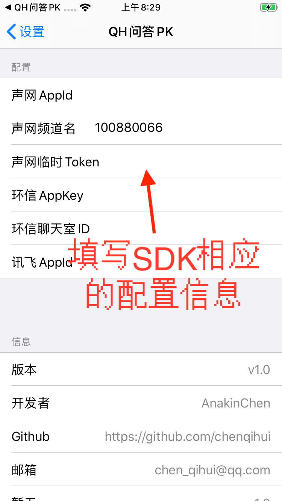
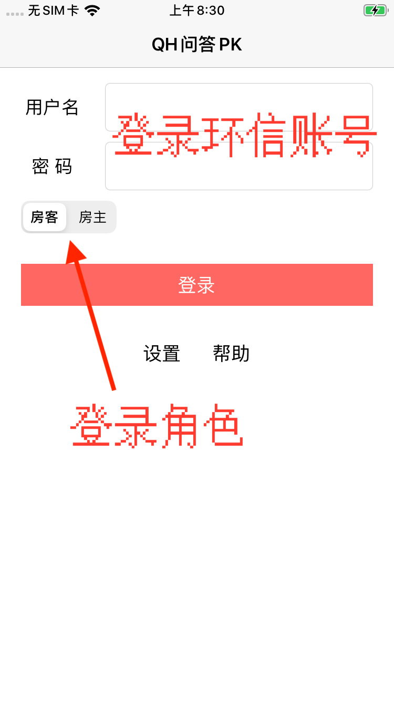
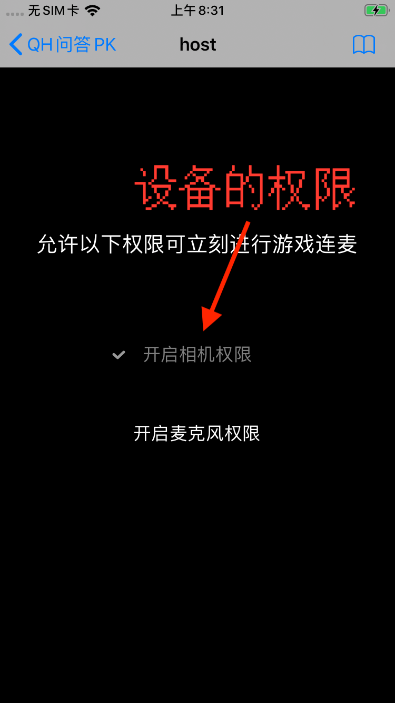
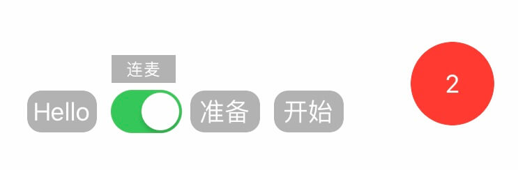
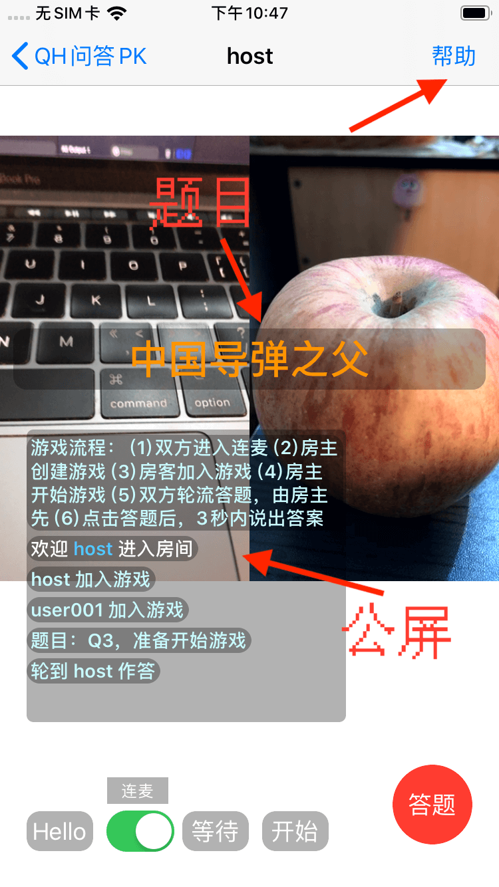
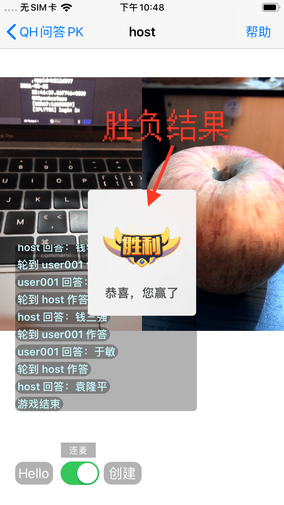
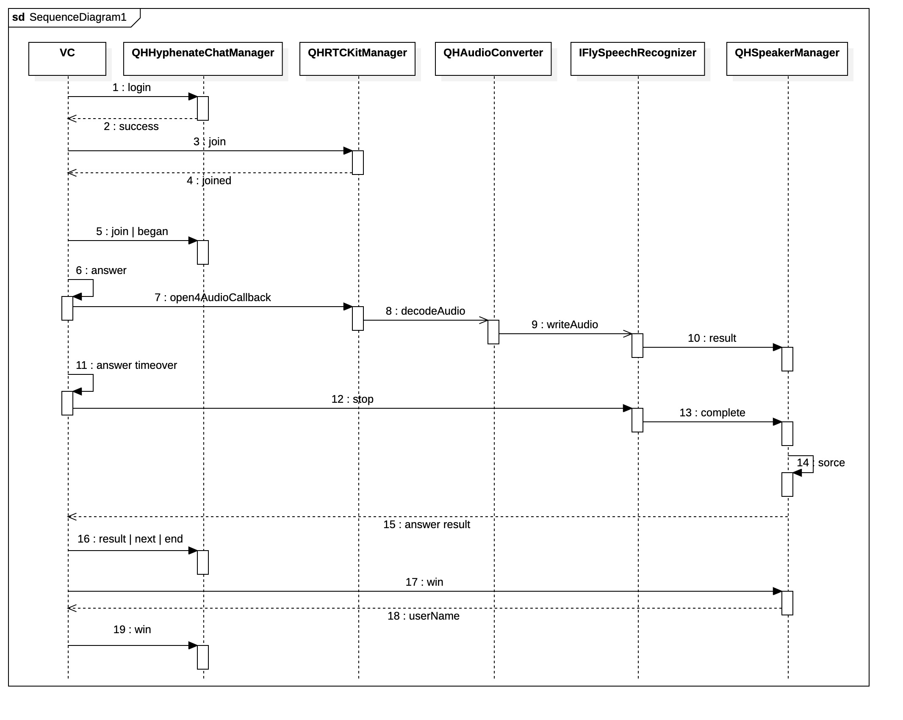
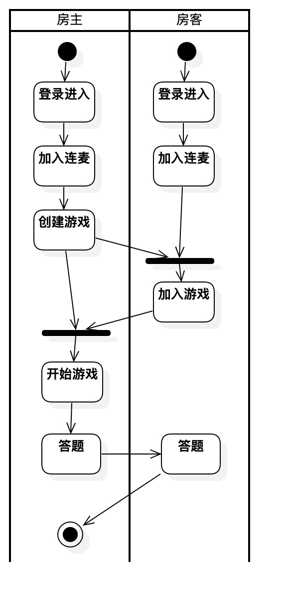
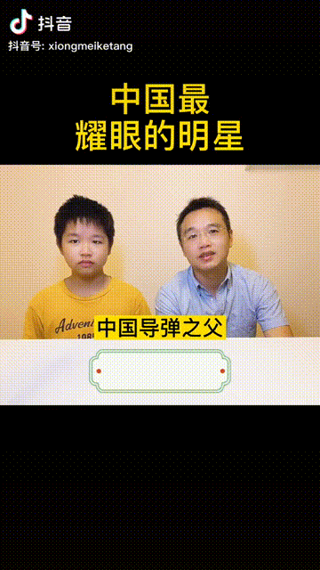

# 题目

&nbsp;&nbsp;&nbsp;&nbsp;&nbsp;&nbsp;&nbsp;《连麦问答PK》——小应用大智慧

# 背景 & 创意

&nbsp;&nbsp;&nbsp;&nbsp;&nbsp;&nbsp;&nbsp;常见的连麦场景下，彼此只是简单的聊天，聊聊家常，或者看看彼此。在短视频有一种常见的视频题材——问答PK，其形式就是在一个系列里提出多个问题，然后轮流答题，可参考后面 [相关视频](#相关视频) 部分。 
 
&nbsp;&nbsp;&nbsp;&nbsp;&nbsp;&nbsp;&nbsp;而将 连麦 & 问答 两者结合起来，即通过 连麦 来进行 问答PK，由答题系统提出的问题，参与连麦的玩家以轮流的方式回答，并将答对的题目数量作为分数的互动游戏。

# 前言

&nbsp;&nbsp;&nbsp;&nbsp;&nbsp;&nbsp;&nbsp;项目工程是基于 声网SDK + 环信SDK + 讯飞SDK 实现的 连麦问答PK 的 iOS App。  

&nbsp;&nbsp;&nbsp;&nbsp;&nbsp;&nbsp;&nbsp;目前实现的是双人之间的 问答PK。可便于亲子，家庭或团队之间的互动，即增进彼此间的感情，还可以通过问答的内容拓展个人的知识面。后期会增加有趣的惩罚机制（如打脸特效，锤子敲打……）。  

&nbsp;&nbsp;&nbsp;&nbsp;&nbsp;&nbsp;&nbsp;题目在项目的设计上方便扩展，让答题有更多的多样性和趣味性。题目即可以类似是 Demo 演示的知识题，也可以增加自定义题目（后期增加，暂时没哈），如设置家庭系列的题目，场景可以是：父子的连麦，题目有妈妈最拿手的是什么菜？爷爷奶奶是什么时候结婚的？爸爸的生日？等等。  

# 目标

~~~
连麦，让距离不再是问题，使互动无法被阻挡。  
答题，即增进彼此的了解，又扩展大伙的知识。 
~~~
 
&nbsp;&nbsp;&nbsp;&nbsp;&nbsp;&nbsp;&nbsp;这样的 连麦问答PK，可以随时随地，有趣又生动的进行。依靠移动互联网的便利，具有教育类的连麦互动游戏，将带来更丰富多彩的生活。

# 运行

~~~
cd QHSpeakerGame
pod install
open QHSpeakerGame.xcworkspace
~~~

&nbsp;&nbsp;&nbsp;&nbsp;&nbsp;&nbsp;&nbsp;将项目的开发证书更换之后，编译即可。但要玩这款 App 的话，还需查看下面的 [注意](#注意) 和 [游戏流程](#游戏流程)，或者查看 App 内的帮助页 及 留意 App 内的公屏指引。

# 注意

&nbsp;&nbsp;&nbsp;&nbsp;&nbsp;&nbsp;&nbsp;本工程只实现 iOS 客户端部分，需要填写配置信息。由于部分信息相对比较隐私 & 具有时效性，所以如需要配置信息，**可邮件联系本人获取，如有不便，请谅解**。

&nbsp;&nbsp;&nbsp;&nbsp;&nbsp;&nbsp;&nbsp;**为了评审的便捷，新增 JSON配置，只需填写这一个配置信息即可，方便评委进行设置 & 测试。请评审时直接微信联系本人获取即可，感谢。**

&nbsp;&nbsp;&nbsp;&nbsp;&nbsp;&nbsp;&nbsp;也可通过 App 的逐一设置进行 [配置](#效果&演示图)，或者手动在如下的函数，只需将最后的注释打开后，直接赋值配置信息。

~~~
QHBase/QHAppContext.m p_readSetting
/*
     // 声网AppId
     self.AGAppId = @"";
     // 声网频道名
     self.AGChannelId = @"";
     // 声网临时Token
     self.AGToken = @"";
     // 环信AppKey
     self.EMAppkey = @"";
     // 环信聊天室ID
     self.EMRoomId = @"";
     // 讯飞AppId
     self.IFlyAppId = @"";
*/
~~~

#### 需要填写的信息

&nbsp;&nbsp;&nbsp;&nbsp;&nbsp;&nbsp;&nbsp;**注意以下例子的参考值非可用信息，请以联系本人获取的为准，这里仅供参考检查，以防填错。**

| 信息 | 字段 | 参考值 |  
| --- | --- | --- |  
| 声网AppId | AGAppId | @"222222fd754263222222222222222"|  
| 声网频道名 | AGChannelId | @"100880066" |  
| 声网临时Token | AGToken | @"aaaaaaaaaaaaaaaaaaaaaaaaaaaaaaaaaaaaaaaaaaa" |  
| 环信AppKey | EMAppkey | @"6666666666666666#speaker-game" |  
| 环信聊天室ID | EMRoomId | @"1486666666666666" |  
| 讯飞AppId | IFlyAppId | @"b2aaaaaaa" |  

# 效果&演示图

&nbsp;&nbsp;&nbsp;&nbsp;&nbsp;&nbsp;&nbsp;可在 App 内的帮助页面中查看更具体的提示

<table>
    <tr>
        <td >
配置
</td>
        <td >
登录
</td>
        <td >
权限
</td>
    </tr>
    <tr>
        <td >
操作栏
</td>
        <td >
答题中
</td>
        <td >
胜负
</td>
    </tr>
</table>

# 模块

#### 功能模块

| Manager | 负责的功能 | 说明 | 
| --- | --- | --- |  
| [声网Agora](https://www.agora.io/cn/) | 控制连麦、布局 & 提供音频原数据 | 连麦的基础，互动画面的数据来源，提供了语音识别的音频数据，及视频数据也可后期增加惩罚的视频处理（如变胖子、锤子动效等） |  
| [环信](https://www.easemob.com/) | 登录、游戏参与、轮流答题 & 答题结果 等信令的收发 & 聊天 | 游戏的流程控制，房主和房客的 cmd 通知的收发 及 处理，如 创建游戏、加入游戏、开始游戏 和 答题等等。 |  
| 语音格式转换 | 将 声网 采集的音频数据进行转码 | 对连麦采集的音频数据进行处理，将采样率，采样格式进行转换，以符合相应语音识别的格式要求。 |  
| 讯飞语音识别| 将语音进行文字识别，并返回文字结果 | 需要拼接返回的结果。采取完全匹配来判断答案正确与否。 |   
| 问答游戏 | 游戏成员、题型 和 答题 进程和答案的校验 & 计分 | 答题游戏题目、答案、参与人员、分数等数据的管理 和 维护。 |  

#### 问答题型：  

| 题型 | 说明 | 举例 | 备注 |  
| --- | --- | --- | --- |   
| ~~GameOne~~ | 一题目多答案 | 明朝的皇帝：朱元璋、朱棣…… | 暂不再继续支持，可忽略 | 
| GameTwo | 一系列多题目，唯一答案 | 中国最耀眼的明星：1、中国导弹之父——钱学森 2、…… | 有Q和Q2，分别为完整题目和简化题目，为方便测试使用了Q2，可在代码修改 |  

# UML图

#### 泳道图（单人）

  

#### 活动图（双人）

  

# 游戏流程

1. 一位以房主登录，一位以房客登录
2. 双方可通过打招呼确认聊天室联通是否正常
3. 双方进入连麦
4. 房主创建游戏
5. 房客加入游戏
6. 房主开始游戏
7. 双方按照指引轮流，点击答题，3秒内说出答案即可，房主先答
8. 分数高者（即问题答对的数量）为胜者，相同分数则平局

# 相关视频

&nbsp;&nbsp;&nbsp;&nbsp;&nbsp;&nbsp;&nbsp;以下 gif 来着抖音的短视频部分内容，仅做延伸的展示，无任何商业用途，如您发现在下侵权可立即联系删除，感谢。这里 [有完整的视频(有声喔)](./ImageResources/speakerPK.MP4) 可看。

  

# 参考

* [RTE 2021 编程挑战赛](https://pages.segmentfault.com/rte-hackathon-2021?utm_source=shengwang&utm_medium=banner)
* [声网 - 文档中心](https://docs.agora.io/cn/Interactive%20Broadcast/landing-page?platform=iOS)
* [iOS SDK 快速集成 [IM开发文档]](https://docs-im.easemob.com/im/ios/sdk/prepare)
* [easemob/livestream_demo_ios: 直播demo iOS](https://github.com/easemob/livestream_demo_ios)
* [语音听写 iOS SDK 文档 | 讯飞开放平台文档中心](https://www.xfyun.cn/doc/asr/voicedictation/iOS-SDK.html#_1%E3%80%81%E7%AE%80%E4%BB%8B)
* [CMSampleBufferRef与byte*互相转换(audio) ](http://www.voidcn.com/article/p-gbhzsksq-ha.html)
