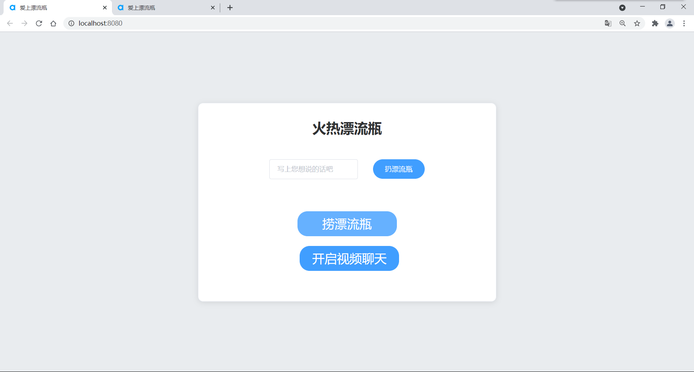
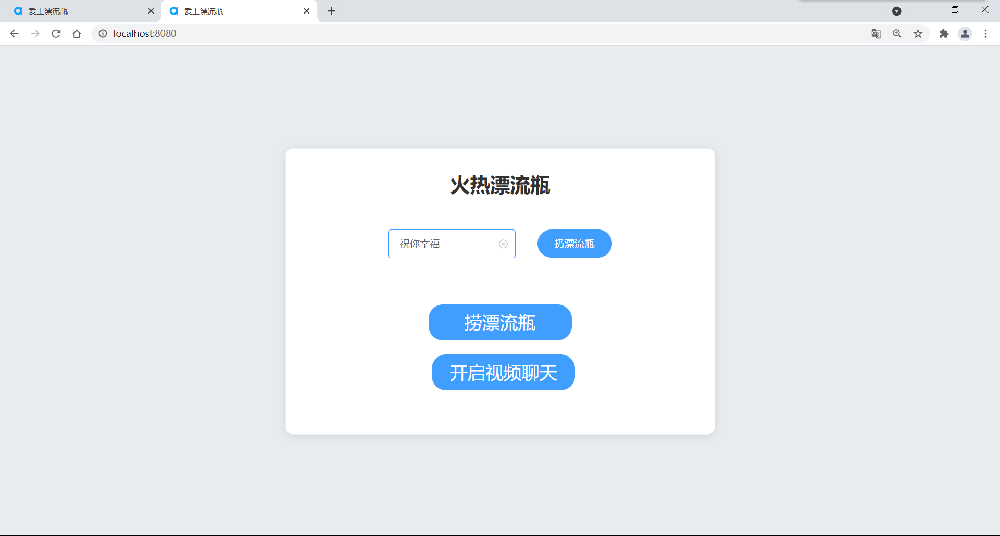
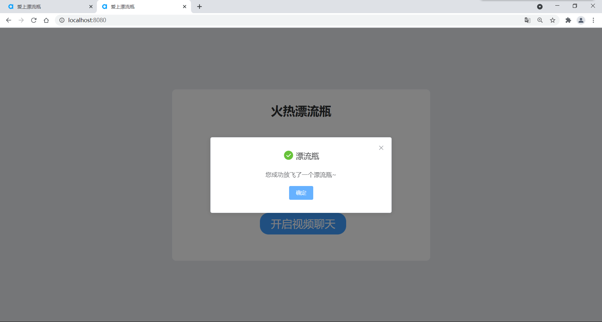
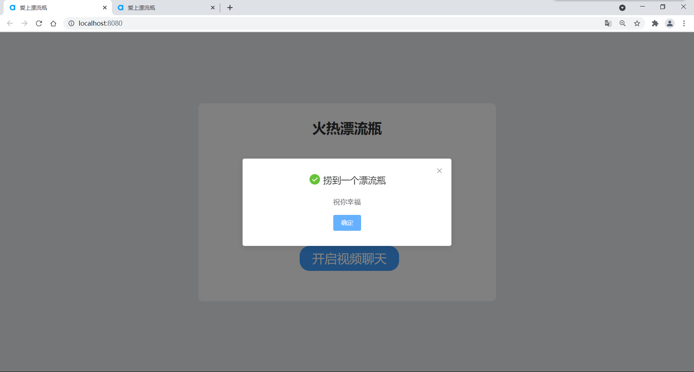
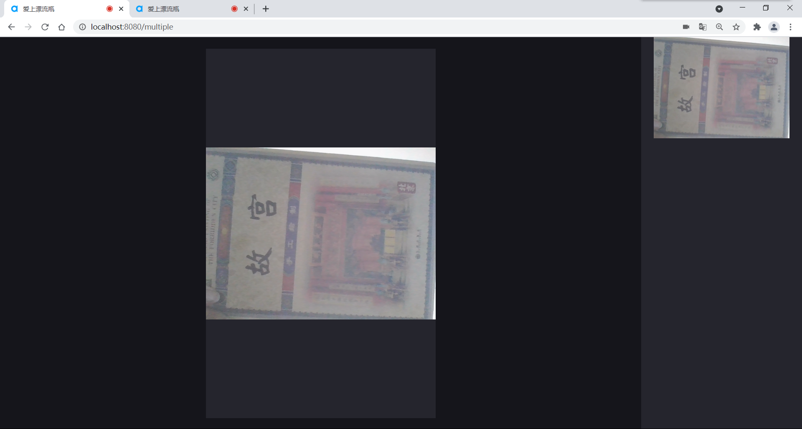

# 爱上漂流瓶

## 1.作品介绍
本项目是一款漂流瓶软件，旨在希望用户能够更多、更热情的与陌生人沟通，扩展自己的交际圈，增强人际交往能力。在本项目中，用户可以扔出自己的漂流瓶，捡起别人的漂流瓶，当漂流瓶不存在的时候会捞出来空瓶。用户还可以加入整个漂流瓶社区的多人视频中来，进一步交友、畅聊。

## 2.使用技术
Vue + Socket.io + 声网技术

## 3.运行指南

**修改config文件夹下的index.js中的Appid**

```shell
# 安装必要依赖
npm install

# 启动后端服务
node server.js

# 启动前端服务
npm run serve
```

```shell
# 正式环境打包
npm run build

# 代码检查及修复
npm run lint
```

## 4.截图












