# 【XMDLAB-L】课堂坐姿检测

## 技术使用：

*采用基于声网提供的Web版本Agora SDK实现网课授课的音视频通话场景

*采用深度学习技术处理学生端视频内容分析其坐姿，在坐姿不良情况下发出提醒

*采用Python Flask框架将后端处理后的结果反馈至前端

*采用Intel OpenVino技术加速深度学习模型在CPU上的处理速度

## 背景介绍：

​		现在在线教育技术日趋成熟，网课越来越普及，青少年在电脑前伏案时间越来越长，这意味着如果长时间保持不良的坐姿将会危害到青少年的身体健康，甚至影响骨骼发育造成严重的不良后果。不良坐姿会造成颈项肌的疲劳，引起颈肩痛、项肌痉挛，甚至出现头晕目眩；久而久之，青少年势必在成年之后过早地出现颈椎间盘退变，导致颈椎病。特别是长期保持不良坐姿，会给颈、背部造成持续的负荷，使背部肌肉、韧带长时间受到过度牵拉而受损，从而引发特发性腰痛。

​		调查显示肩部腰部疾病的发病率越来越高，发病年龄越来越小，跟学生长期保持不良坐姿有关。这些问题都说明，坐姿正确与否对健康有很大影响。在工作强度越来越大、休息锻炼时间越来越少的今天，在学生时期保持正确坐姿养成良好的习惯就变得非常有必要了。

​		正确坐姿可以容易快速的掌握，但是维持却很难，因为我们在工作和学习中等忙碌的情况下，很容易忽视姿势的变化，如果在姿势不正确时能随时的被提醒是否驼背则对保持坐姿正确有着重要意义，那么此时，一款智能的坐姿检测软件就显得十分重要了，因此我基于上述技术开发了一端教室场景，或网课场景的坐姿检测系统。

下面两幅图像展示了不良坐姿以及造成的问题

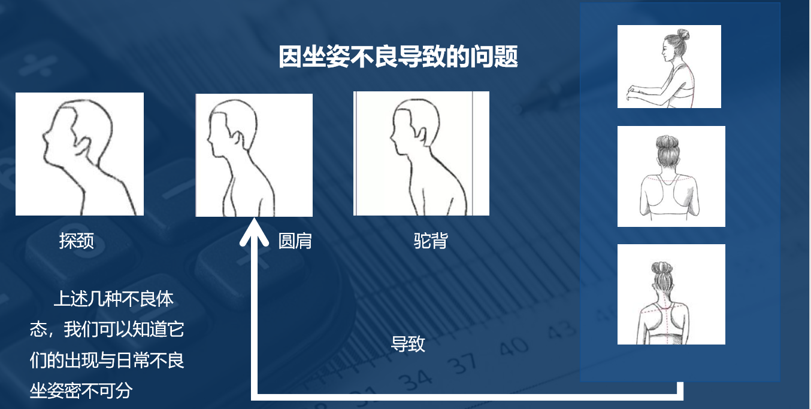

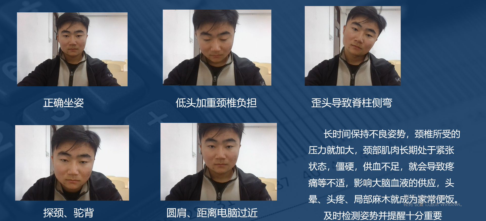

## 项目展示		

下图展示本项目后端处理结果,样例视频在VideoDemo文件夹下

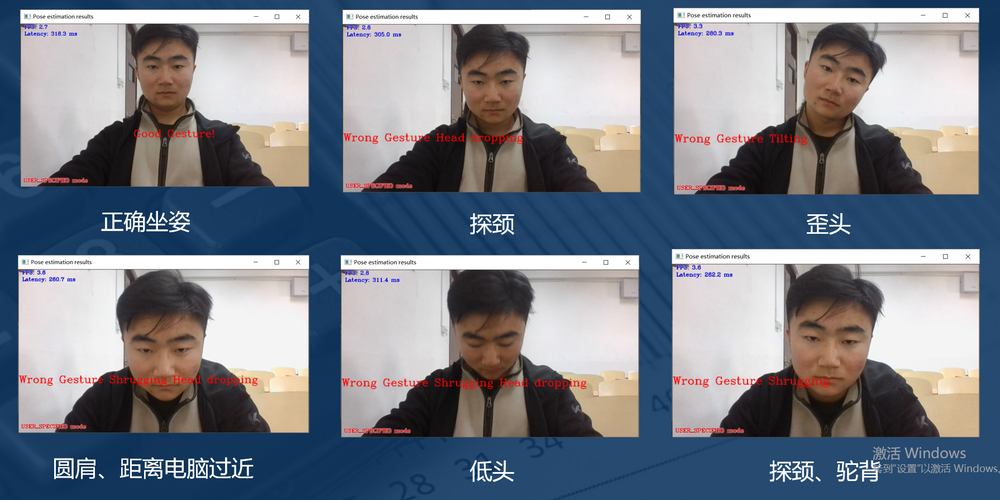

下图展示调用Agra SDK音视频通讯接口后的模拟在线课堂效果此为教师视图可观察学生姿态

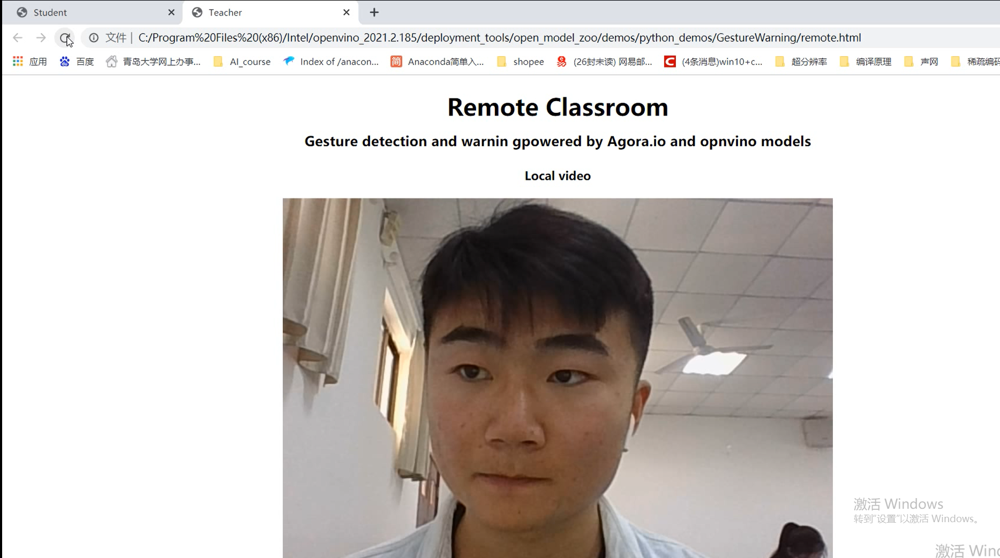

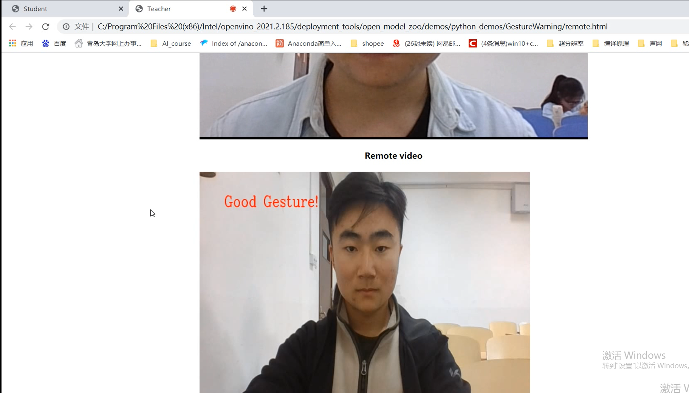

下图为学生端，展示本地处理后的结果

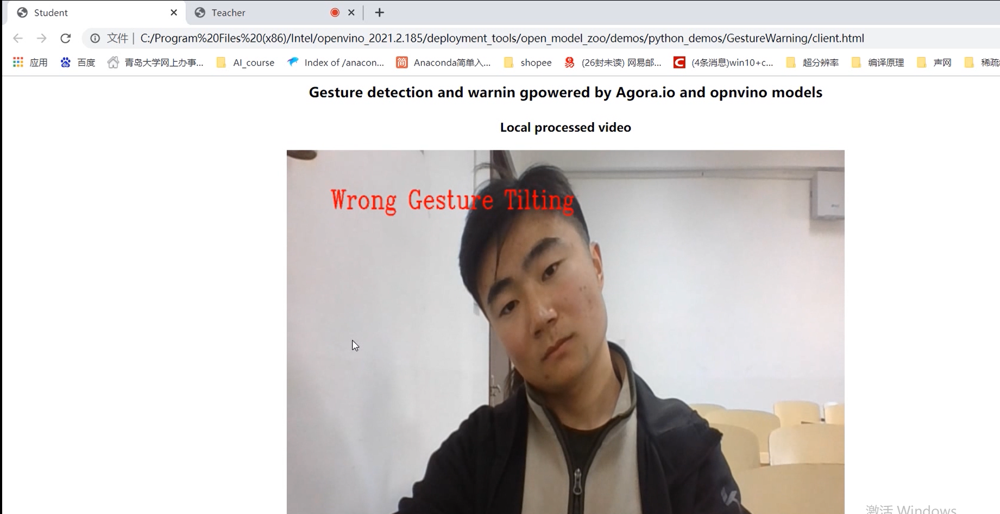

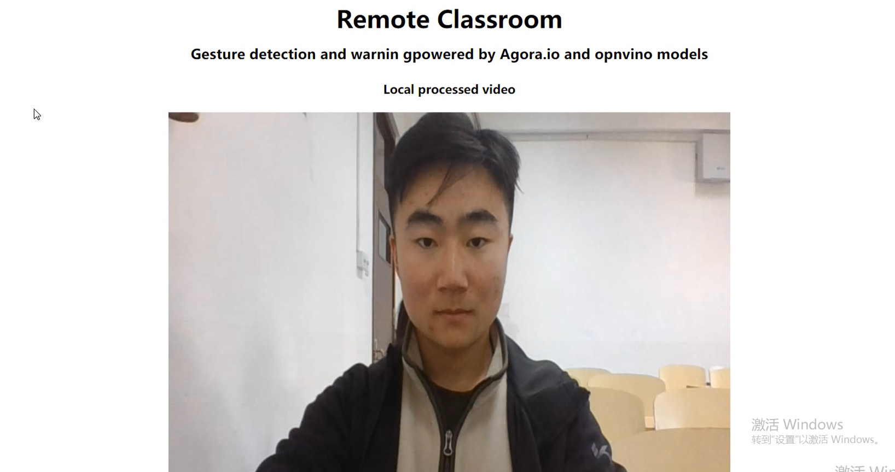

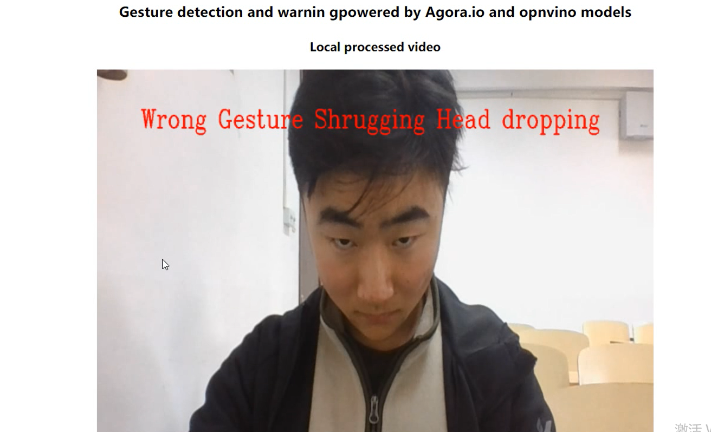

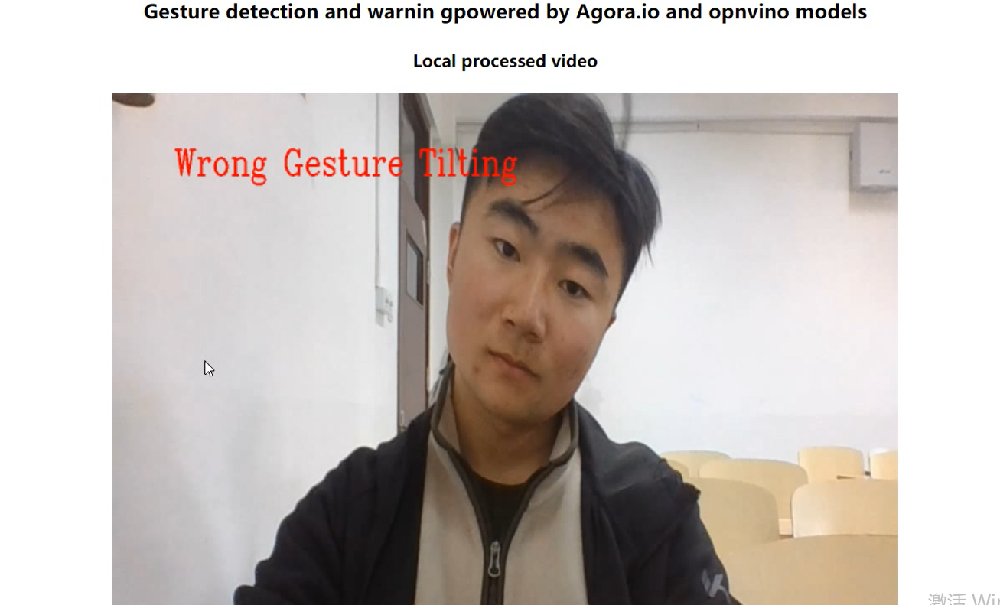

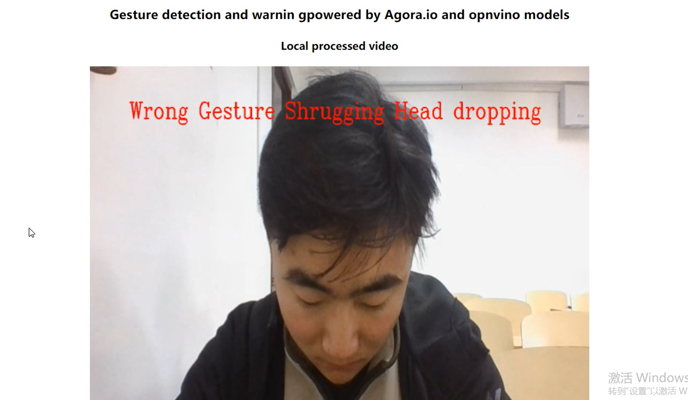

## 运行所需配置

### 环境要求：

Windows10、python3.7以上、AgoraRTCSDK-3.5.2、OpenVino（w_openvino_toolkit_p_2021.2.185）

### OpenVino配置：

下载w_openvino_toolkit_p_2021.2.185

下载地址：

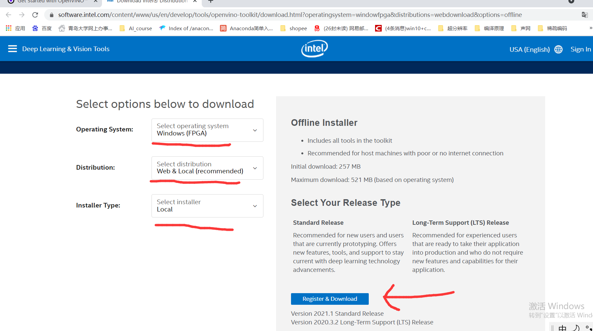

配置教程：

配置中请按照默认路径配置

### 务必将此文件夹放置在下面的文件夹中

C:\ProgramFiles(x86)\Intel\openvino_2021.2.185\deployment_tools\open_model_zoo\demos\python_demos

### Python依赖包

pip install -r requirment.txt

### 运行指南

cd C:\Program Files (x86)\Intel\openvino_2021.2.185\bin 执行.bat激活环境

运行server.py

`python server.py`

将script文件夹下的srcipt.js、srcipt_remote.js中的APPID以及token改为自己的

点击client.html与remote.html预览效果

如果要更改坐姿检测视频源请更改GestureProcess.py中build_argparser()中--input的默认值
