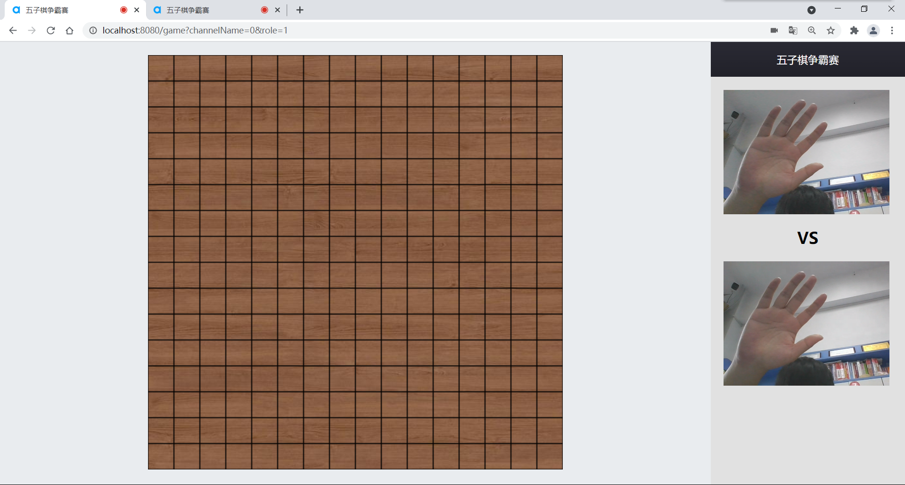
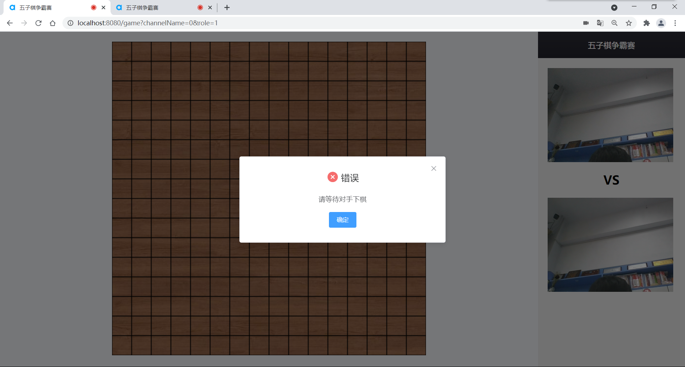
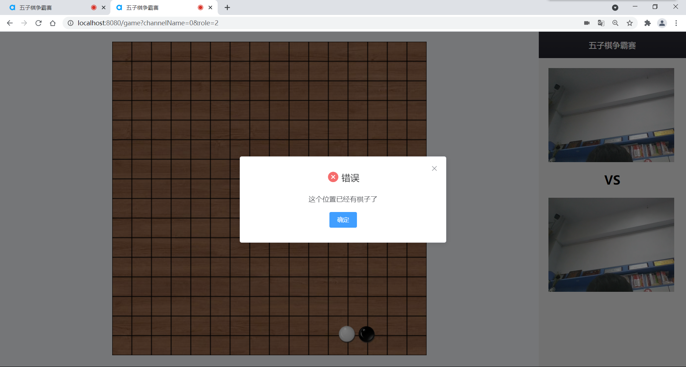
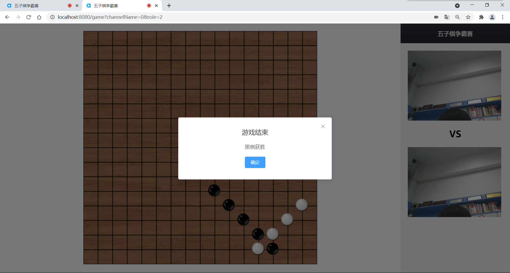

# 五子棋争霸

## 1.项目简介
随着时代的发展，人们的生活水平逐渐提高，生活的节奏也变得越来越快。在满足了对吃饱、穿暖的基本追求后，人们开始追求更高等级的精神上的满足。

为了生活，我们只能在四处奔波，与三五好友相聚在一起都仿佛成为了一种奢望。大家流落在天南海北，祖国各地，每一次见面都需要耗费大量的时间、精力。因此，我们希望开发一款可以无视距离，让大家享受到朋友之间的温暖和快乐，让大家可以开怀大笑、增强友谊的应用。

五子棋是全国智力运动会竞技项目之一，是一种两人对弈的纯策略型棋类游戏。五子棋的棋具与围棋通用，是一种传统的棋种，它容易上手，老少皆宜，而且趣味横生，引人入胜，不仅能增强思维能力，提高智力，而且富含哲理，有助于修身养性。是朋友之间相聚、聊天、娱乐的必备佳品。

目前，棋牌类游戏在我国的娱乐产业中仍然占有很大的比重，不管是在手机、电脑，还是在路边、公园里，棋牌的这种娱乐形式都随处可见。所以，电子棋牌拥有者数量庞大的潜在用户。基于以上考虑，我们结合声网SDK，开发了一款支持视频通话的在线五子棋对战应用，希望可以借此增强用户之间的感情羁绊，并为日后创造经济效益打下基础。

## 2.功能简介

- 输入用户名创建用户，若用户名与已存在用户相同则会给出提示，引导重新填写用户名
- 查看在线用户列表，并可选择用户发起对战邀请
- 被挑战用户收到对战邀请，可选择接受或拒绝
- 接受挑战则进入实时对战、实时视频的对战页面
- 完善的五子棋游戏机制

## 3.技术栈
前端Vue 后端 Socket.io

声网SDK实现实时视频

## 4.项目运行指南
- 安装必要依赖

```
npm install
```

- 启动后端服务

```
node server.js
```

- 启动前端服务

```
npm run serve
```

- 正式环境打包

```
npm run build
```

- 代码检查及修复

```
npm run lint
```

## 5.项目截图








