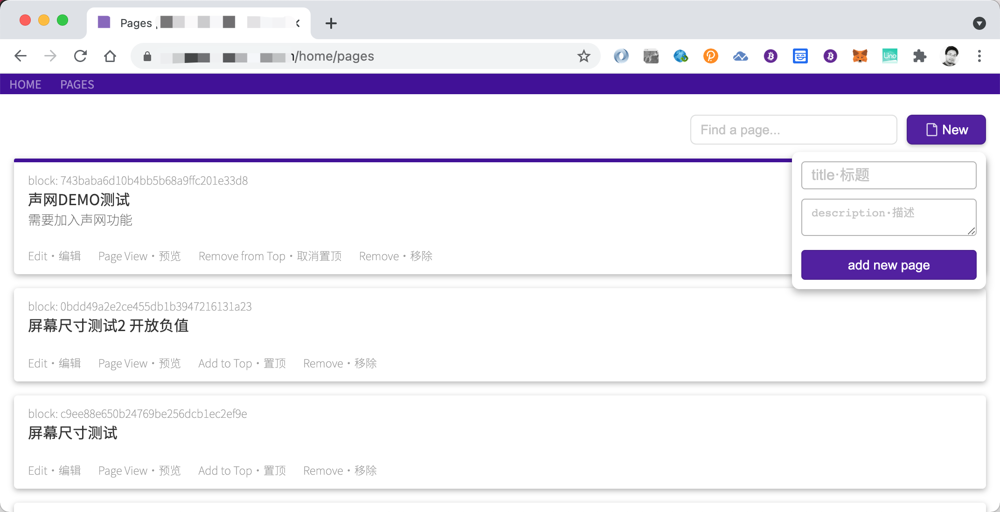

### Web共享编辑页面生成器

本项目为自2021年4月22日起基于创意进行全新的应用开发，目标为一块可私有化部署使用的Web共享编辑页面生成器。

#### 实现目标
1. 低代码模式，拖拽模式可布局页面
2. 页面编辑使用contenteditable属性，所见即所得
3. 视频模块使用video.js集成，可以支持.m3u8格式直播（跨域支持时）
4. 可局部添加前端代码
5. 可直接使用检查模式/审查元素/开发者工具模式进行页面内容更新（编辑后，通过增删空格触发）
6. 可以使用自己的agora账号进行编辑页面内文档的即时语音/视频沟通
7. Realtime实时的编辑体验
8. 编辑内容可作为网页发布
9. 作为发布页面内容，可即时修改
10. 可在同一浏览器内，共享粘贴板和多选复制功能
11. 可邀请他人一块参与页面编辑

#### 解决的问题
1. 编辑发布页面需要写代码
2. 修改内容不是即时呈现，需要页面刷新
3. 网页页面修改，无法多人同时参与
4. 笔记功能产品无法拥不同内容（样式、图片、直播、视频、链接、html代码混合）
5. 白板工具内容，无法单独作为排版内容输出呈现
6. 静态网页建站需求，无法完美按照设计稿实现出来

#### 运行说明
1. 本项目基于Python3.x Tornado框架产品化
2. 使用NoMagic for mysql，改装mysql为key-value模式，类nosql使用
3. 本项目限制提交账户配置信息setting.py auth.py
4. 项目体验地址：[demo体验](https://findmaster.xialiwei.com) 请使用邮箱注册后使用

#### Demo截屏
