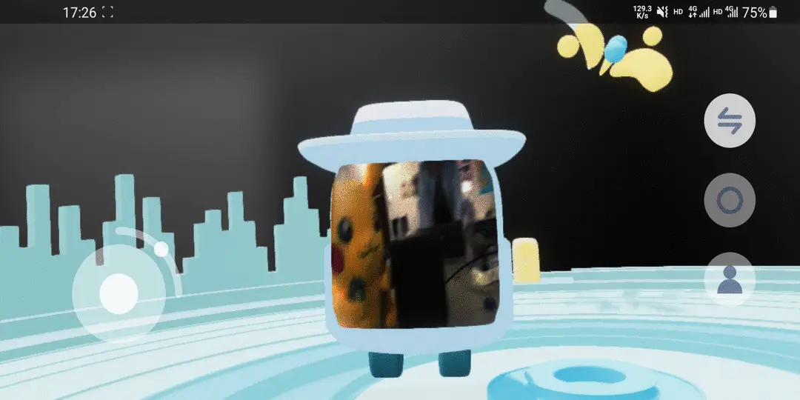
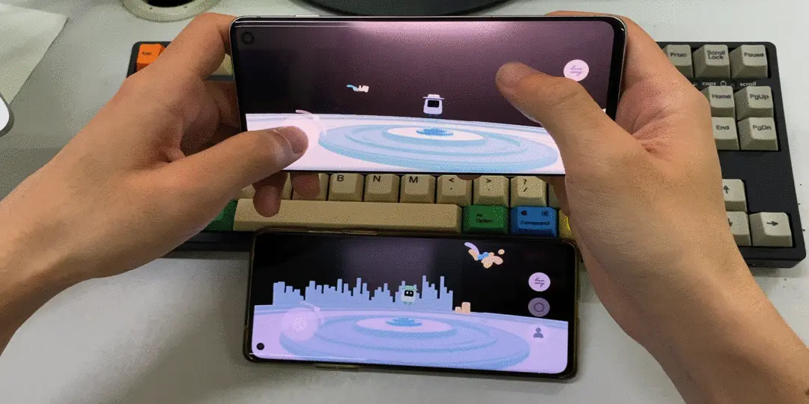
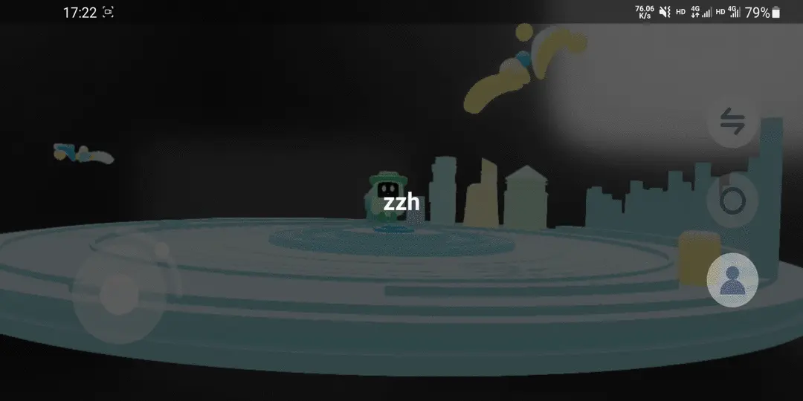
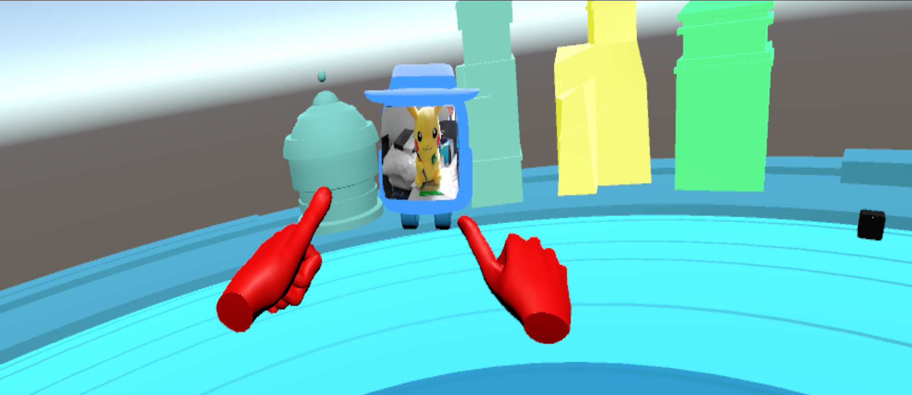

<p align="center">
  
</p>

# WeIn

为用户提供多人互动的虚拟3D场景，

优秀的音视频性能，沉浸的场景体验，丰富的互动能力，

让你可以在场景中和别人自由交流，或者做到更多

# 支持平台


# 项目亮点

### 空间音频

本项目通过使用 Google 提供的 Spatial Audio API 在 Android 手机环境实现空间音频，

使用户在场景中对话时，可以根据声源相对虚拟形象的方向和位置获得不同的听觉体验，

有效提升用户的场景沉浸感

### 空间交互

本项目通过使用设备的地磁场传感器和加速度计在 Android 手机环境实现六自由度的空间交互，

使用户在场景中运动时，可以通过改变手机方向操纵虚拟形象进行六自由度的方向旋转，

有效提升用户的操作灵活度

### 跨平台互动

本项目现可支持 Android 和 Unity 双平台互动，

且 Unity 版本在 VR 环境下运行，提供更强的视觉沉浸感，

同时，项目具备良好的可移植性，只需要较少的开发成本即可支持 iOS 平台

### 低带宽要求

本项目仅需较少的数据传输量，

在场景中每增加一个用户，只需增加1.5kb每秒的数据量，

同时，用户在弱网环境下仍可稳定运行

# 产品功能

### 虚拟形象

用户可以选择完全虚拟形象进入场景，

且该虚拟形象的面部表情与用户同步


### 视频形象

用户可以选择非完全虚拟形象进入场景，

该虚拟形象将提供视频窗口呈现用户真实场景



### 空间音频

用户在场景中对话时，可以根据声源相对虚拟形象的方向和位置获得不同的听觉体验

### 空间交互

用户在场景中运动时，可以通过改变手机方向操纵虚拟形象进行六自由度的方向旋转，

点按屏幕上半部分可使虚拟形象在该方向前进，

点按屏幕下半部分可使虚拟形象在该方向后退


### 轮盘交互

用户可以通过交互模式切换按钮从空间交互模式切换至轮盘交互模式，

在该模式下，用户通过转动轮盘来调整方向，

点按屏幕上半部分可使虚拟形象在该方向前进，

点按屏幕下半部分可使虚拟形象在该方向后退



### 方向还原

点击方向还原按钮，虚拟形象的方向将转移至上一次从轮盘交互切换至空间交互时的方向

### 自动寻人

点击寻人按钮后，在列表中选择你要寻找的用户名称并点击选择，即可自动飞至该用户所在位置



### VR环境

Unity 版本在 VR 环境下运行，且通过手势进行交互，提供更好的场景沉浸感




### 彩蛋

该功能需要在Unity环境下配合HTC Vive及Noitom Hi5方可使用，

答辩时将会进行展示，敬请期待~


---


# Roadmap

[项目心路历程](ROADMAP.md)

# Compile

## Android

### 基础构建
不需要对场景材质光照模型等做出修改的情况下，使用 **Android Studio 4.2.0** 及以上版本打开项目根目录下的 android 项目即可直接编译

### 完整构建
如果需要更改材质光照模型，需要配置 Filament 的二进制依赖。

在 [Filament Release Page](https://github.com/google/filament/releases) 下载 1.9.21 版本的 host 平台的二进制文件并解压

在 android 项目的 local.properties 添加 filament.dir=bin_path，触发编译即可

```
filament.dir=/Users/abc/path/to/filament
```

## Backend

后端使用 rust 语言开发，需要配置 rust 环境。

参考 [rust install](https://www.rust-lang.org/tools/install) 安装 cargo 后
在项目根目录下执行 
```
cargo build --manifest-path backend/Cargo.toml
``` 
默认监听 12305 端口

## Unity

Unity 模块**强依赖** [NOITOM HI5 VR 手套](https://www.noitom.com.cn/hi5-vr-glove.html) 来提供手部动作捕捉能力

如果**没有手套硬件**的话无法完整的体验 Unity 模块的所有能力

项目使用 Unity-2019.4.18f

### Vive

在 Package Manager 中，添加 Vive 注册表详细信息，以便 unity 能够找到需要的依赖：

Name: Vive

URL: https://npm-registry.vive.com

Scope: com.htc.upm

添加完毕后可以在 my registry 中安装 Vive 相关依赖

### XR-SDK

在 Package Manager 中，下载 XR interaction 依赖

### SteamVR

输入模块使用了 steamVR，需要先安装 [steamVR](https://store.steampowered.com/steamvr) ，然后使用设置房间规模，并进行设备的配对

详细配置方式以及声网模块的安装可参见[官方推文](https://mp.weixin.qq.com/s/gNEBTpwPxl-7ZrhmD8yHFg  ) 

# Main Dependencies

## Android

- [Agora](https://www.agora.io/)

- [Filament](https://github.com/google/filament)

- [Resonance Audio](https://github.com/resonance-audio/resonance-audio)

- [ML Kit](https://developers.google.com/ml-kit)

- [ARCore](https://developers.google.com/ar)

## Backend

- [hyper](https://hyper.rs/)

- [serde](https://docs.rs/serde/1.0.126/serde/)

## Unity
- [Vive](https://www.vive.com)

- [XR-SDK](https://docs.unity3d.com/ru/2017.2/Manual/XR-SDK_overviews.html)

- [UniGLTF](https://github.com/ousttrue/UniGLTF.git)

# LICENSE

[](https://opensource.org/licenses/MIT)
