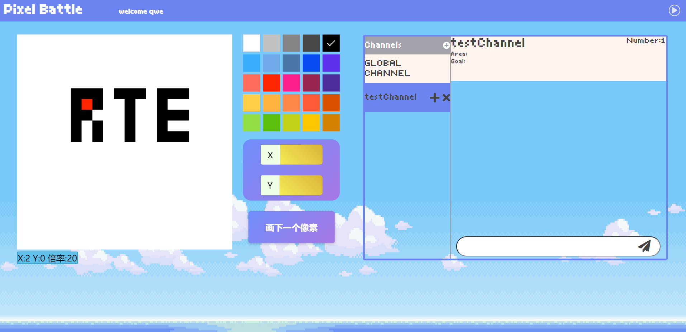
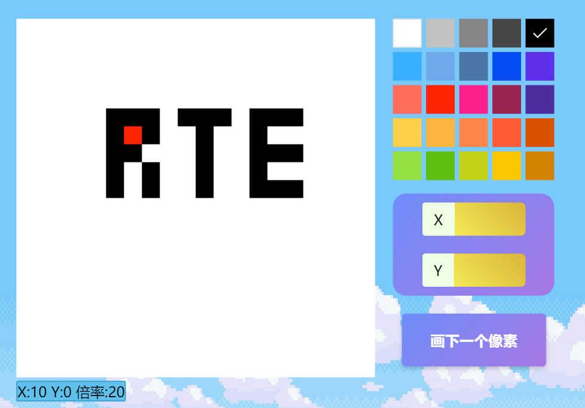
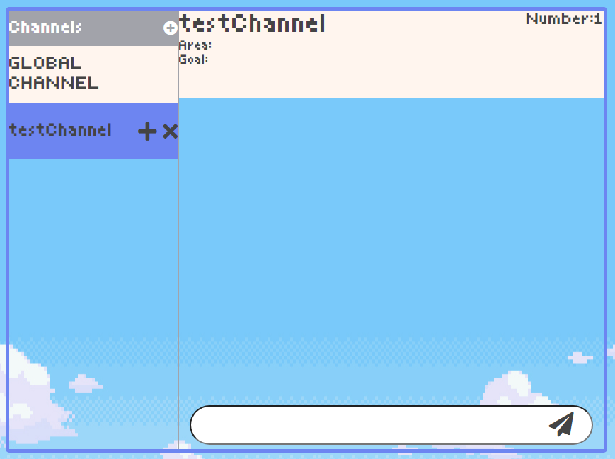
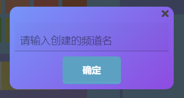
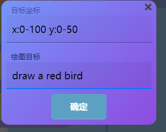

# Pixel Battle
---
## 项目背景
某知名404网站Reddit与2017年愚人节发起一箱社会实验:注册用户可以在画布的任意位置放置一个像素(16色选1),放置每个像素后，计时器会在 5 到 20 分钟的时间段内阻止用户放置任何像素. 
该实验在创建后约72个小时于2017年4月3日由Reddit管理员终止。超过100万用户编辑了画布，放置了大约1600万图块，并且在实验结束时，超过90,000用户正在积极查看或编辑:其中包括组织作画者,用单一像素破坏者,黑客等.  
然而中国是互联网用户数量最多的国家,国内互联网公司似乎并没有发起过类似的活动

---
## 应用场景
适合ACG领域互联网公司举办在线作画活动

## 技术使用:
前端:Vue+HTML+CSS+JS  
后端:Node.js+express  
声网SDK:云信令SDK

## 如何运行项目
### 我只想运行看看效果
打开`./public/javascripts/main.js`, 将`appID`改为自己的appID  
打开`./routes/token.js`, 将`appID appCertificate`改为自己的appID,appCertificate
`npm install`  
`npm run build`  
`npm run start`  
浏览器输入`127.0.0.1:8081`
#### 整个界面

右上角点击可以播放蜜汁动感BGM
#### 画布
  
画布为400×400像素  
点击画布可以选择坐标,滚轮缩放画布,拖拽移动画布  
画布每隔一段时间自动从服务器获取最新结果并渲染 (默认60秒)
右侧可以选择一种颜色,点击按钮画一个像素,需要等一会儿才能继续画 (默认2秒)  
#### 聊天
  
有一个公共频道,用于宣传自己创建的频道  
点击加号可以添加频道  
  
点击频道名右侧加号可以为频道添加一些信息:想要作画的区域,想要画的内容,信息会显示在聊天框的上方  
  
点击×号退出频道  
为防止敏感信息,频道仅支持发送文字,不支持图片.  

---
### 我想用用看,修改一些东西
默认端口和ip为`127.0.0.1:8081`,如需修改,则需要将其他文件中的ip,端口同时修改  
`./routes/pixelArt.js` 中的`delay`为每`delay`秒创建一个当前画布的图片,保存在`./public/history`文件夹中  
`./public/javascripts/canves.js`中`delayGetSvg`为向服务器请求图片的延迟(秒),`delayDraw`为放置像素后的延迟(秒)  
`./public/history`中的为保存的图片,如有需要可以删除,`0.svg`除外. 
 
## 未来改进方向
1.找个UI设计师把这丑到爆的页面修改修改  
2.优化svg图片存储方式,节约传输带宽,服务器压力,浏览器计算压力  
3.优化画布设计  

## 联系方式
E-mail:`jphandll@gmail.com`
