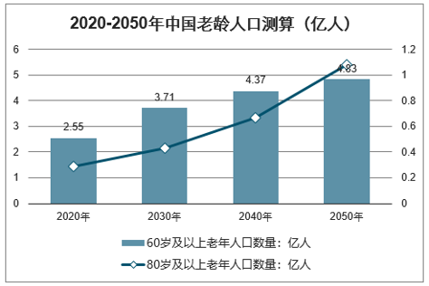
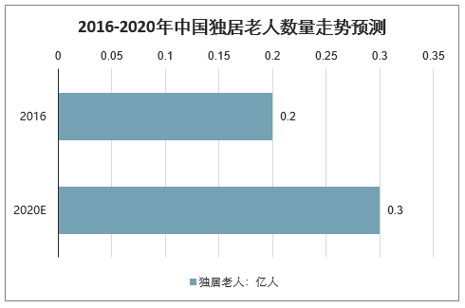
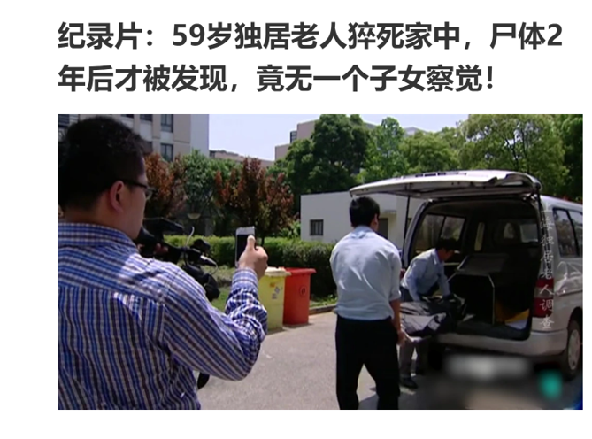
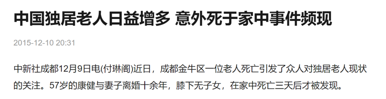
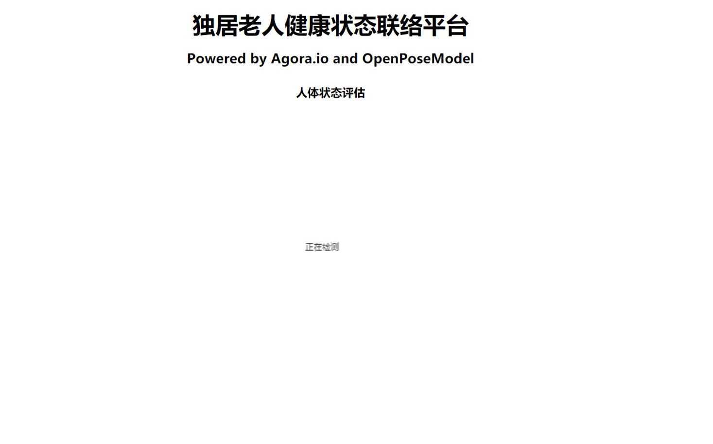
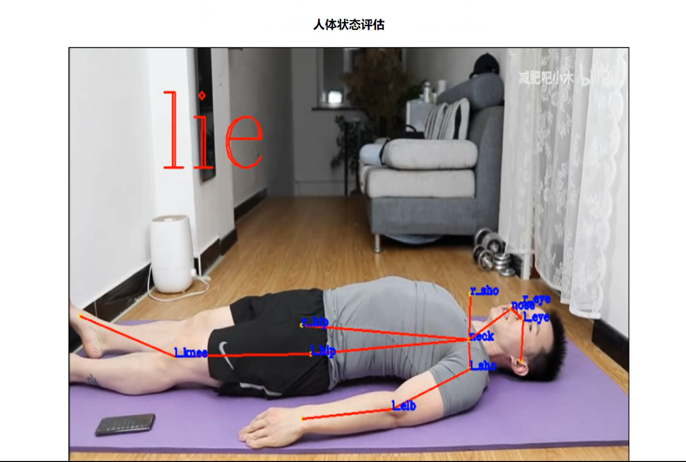
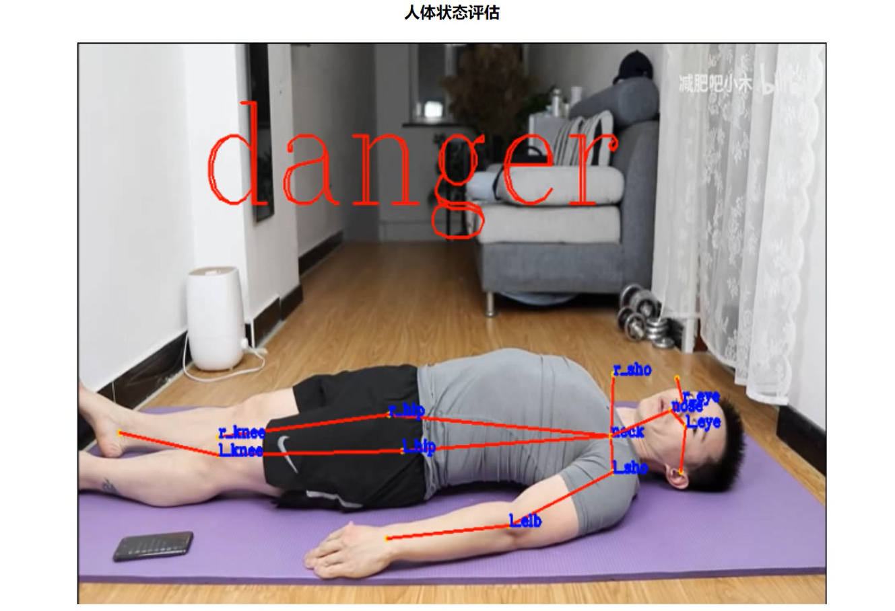
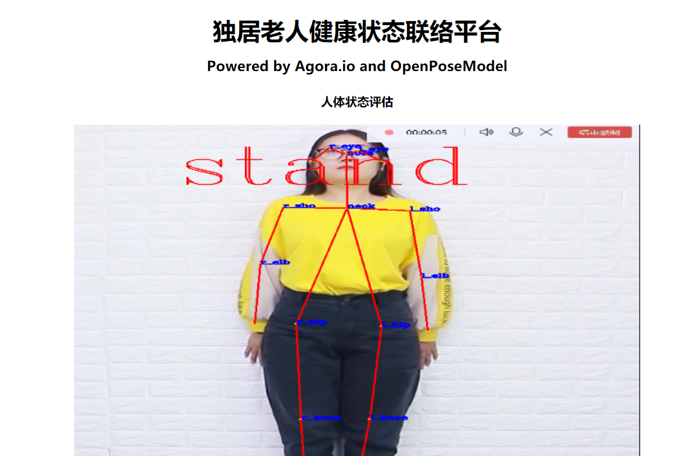

# 星星球--独居老人健康状态联络平台--郭春晓

## 项目背景：

​		智研咨询发布的《2019-2025年中国老年健康服务行业市场全景调查及投资方向研究报告》数据显示：到2018年末中国60岁及以上人口为24949万人，占17.9%，其中，65岁及以上人口为16658万人，占11.9%。，60岁及以上人口增加859万人，比重上升0.6个百分点；65岁及以上人口增加827万人，未来中国老龄人口将进一步增加。预测2020年、2030年、2040年、2050年我国60岁及以上老年人口数量将分别达到2.55亿人、3.71亿人、4.37亿人和4.83亿人，80岁及以上老年人口数量将分别达到0.29亿人、0.43亿人、0.67亿人和1.08亿人。

​		随着社会人口老龄化越来越严重，越来越多的老人成为独居老人。而独居老人发生意外，长时间未被发现的情况发生率上升。所以，我们针对此问题开发了独居老人健康状态管理系统。

## 项目简介：

​		通过人体姿态评估的方法，利用摄像头视频影像借助OpenPose等深度学习模型以及状态判断算法，判断独居老人的健康状态，如长时间躺卧在地板上未见站立行为、快速摔倒等被视为危险状态，在发生危险状态时自动利用声网直播SDK及通讯SDK像老人的亲属或监护单位发送警告提醒以及直播状态。

##### 		下图为独居老人健康状态联络平台demo示意图

##### 		经过系统检测发现人体姿态为躺卧

##### 在非休息时间以及休息区域躺卧过久则视为危险状态发送危险信号至相关人员，并直播现场画面

##### 		系统检测人体姿态为站姿

## 运行指南

##### 安装所需python包

pip install requirement.txt

##### 若电脑以在Windows环境下配置CUDA并使用想gpu则仅需

将mypose/process.py中的load_Info中checkpoint = torch.load(args.checkpoint_path, map_location='cpu')改为checkpoint = torch.load(args.checkpoint_path, map_location='gpu')

##### 下载模型

百度云下载：

链接：https://pan.baidu.com/s/1FaR3tkK3Viz6sntMg71-Cg 
提取码：s769 

##### 运行

更换测试视频或调用摄像头请更改mypose/process.py中的load_Info

python server.py

index.html

