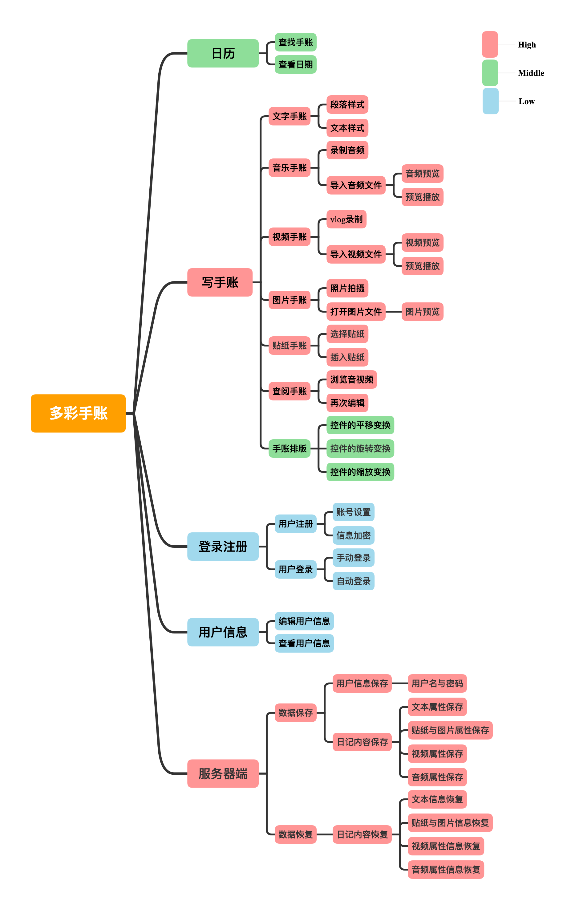

# 多彩手账

## 项目背景

大学生活有很多重要，精彩的事，但是只通过文字和图片来记录表达这些事情显然不够，我们的目的是制作一个包括音频视频的日记手账软件，能够更加便捷记录身边的事，同时能够让记录更加精彩。

## 运行说明

1. 启动服务器

   `cd .../socketserver` 

   `java SocketServerMain`v 

   提示“wait for connection”则服务器启动成功

2. 注册运行“多彩手帐”APP

## 项目演示

<table><tr>
<td></td>
<td></td>
<td></td>
<td></td>
</tr></table>

<table><tr>
<td></td>
<td></td>
<td></td>
<td></td>
</tr></table>

<video width="320" height="240" controls>   
	<source src="images/多彩手帐.mp4" type="video/mp4">  
  您的浏览器不支持Video标签。
</video>

## 开发环境

- 最新的Android Studio集成开发环境
- IntelliJ IDEA集成开发环境

## 系统功能

