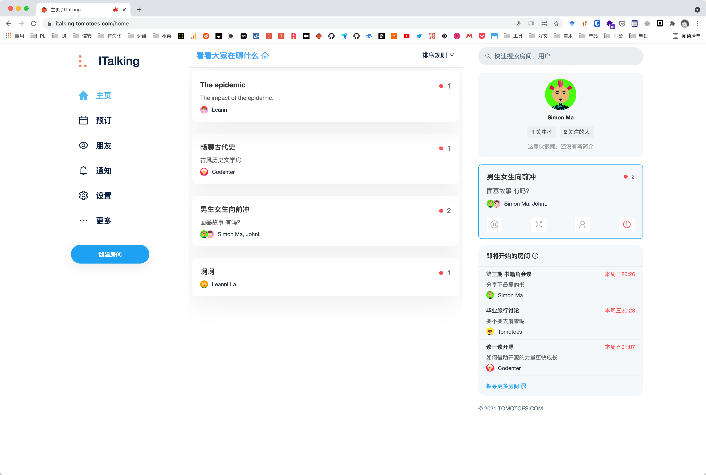

	
	 
	<h1>ITalking</h1>
	Built with ❤︎ by <a href="https://tomotoes.com">Simon Ma</a>

✨ <strong>Create / Share / Explore / Connect 🚀</strong>

  
  
  

## 👀Table of contents

- [💡Introduction](https://github.com/Tomotoes/ITalking#introduction)
- [✨Features](https://github.com/Tomotoes/ITalking#features)
- [🔥TechStack](https://github.com/Tomotoes/ITalking#techstack)
- [🎱Install](https://github.com/Tomotoes/ITalking#install)
- [🎯Dev](https://github.com/Tomotoes/ITalking#dev)
- [🎨TODO](https://github.com/Tomotoes/ITalking#todo)
- [💚Reward](https://github.com/Tomotoes/ITalking#reward)
- [📃License](https://github.com/Tomotoes/ITalking#license)

## 🎉Introduction

[Online browsing](https://italking.tomotoes.com)

Clubhouse is the hottest app on the Internet, and with the buzz generated by Elon Musk, the world's richest man, it has not only shot to the top of the App Store, but has also been in short supply of invitation codes. Currently, Clubhouse has over 2 million users and is valued at $1 billion. In the domestic stranger social track, ecological competition is also very fierce, in addition to some of the old entrants, such as: Soul, Stranger, Tan Tan, by the overseas market social voice boom and the epidemic black swan catalyst online traffic, the last two years Tencent, Netease, Baidu, Jingdong and other giants have also increased the layout of stranger social, although there has not been a pop product, most of which ended without a hitch, but who have Although there has not yet been a breakout product, most of which did not end, but no one has given up this piece of traffic wilderness. This shows that the stranger social track has been in the wind.

In today's highly developed technology, real-time media information transmission has become less difficult, and it is possible to use existing technology to create a platform that meets the national conditions and helps strangers to socialize.

The first version of the project chose Web, and technically, the front-end uses React plus Typescript; the server uses Golang for logic processing; MySQL and Redis for data storage; and the real-time streaming media transmission uses the industry's mature WebRTC solution.

The platform's short-term positioning, a channel to relieve loneliness; long-term positioning, a platform to express and confide in with confidence.

## ✨Features

1. To build a virtual cial metaverse. 

   We encourage strangers to socialize, and everyone has their own unique avatar.

2. Embracing the value and experience of building genuine connections.

   Strengthen the connection between people through the concept of voice room.

3. Build a strong technology stack to better support the platform.

   Always be the hippest platform using a variety of the latest open source technologies. If you're a techie, then come along and contribute.

## 🔥TechStack

### Fronted

| Technology       |    Selection     |
| :--------------- | :--------------: |
| Library          |      React       |
| UI Components    |   Antd.design    |
| State Management |     Rematch      |
| Bundler          |       CRA        |
| Language         |    Typescript    |
| CSS              | Styled-Component |
| Feed Render      |   Virtual List   |
| Avatar           |   multiavatar    |
| Emoji Input      |    Emoji-Mart    |
| Error Monitor    |      Sentry      |
| I18N             |     i18next      |
| PWA              |    WorkerBox     |
| Native           |     Electron     |

### Service

| Technology               |    Selection     |
| :----------------------- | :--------------: |
| Language                 |      Golang      |
| Cache                    |      Redis       |
| Database                 |      MySQL       |
| ORM                      |       Ent        |
| Web Framework            |       Gin        |
| Configuration Management |      Dotenv      |
| Encryption               |      crypto      |
| Error Monitor            |      Sentry      |
| State Management         | Cookie + Session |

## 🎱Install

A desktop app built with [Electron](https://www.electronjs.org/) is available for Windows, Mac, and Linux.

Click here to download [App](https://github.com/Tomotoes/ITalking/releases).

## 🎯Dev

Feel free to open issues or PRs for any problem you may encounter, typos that you see or aspects that are confusing. Contributions are welcome, open an issue or email me if you have something you want to work on.

Please read [CONTRIBUTING.md](https://github.com/Tomotoes/ITalking/blob/master/CONTRIBUTING.md) for details on this project.

## 🎨TODO

1. Mobile style refactoring.
2. Deployment Multi-Region.
3. Promote the project.
4. Support other platform login.
5. Optimize voice transmission speed.

## 👀Reward

If you like `ITalking` and it really helps you, please give me a cup of coffee~

paypal: [https://paypal.me/tomotoes](https://paypal.me/tomotoes)

## 📃License

**GNU GPLv3**

