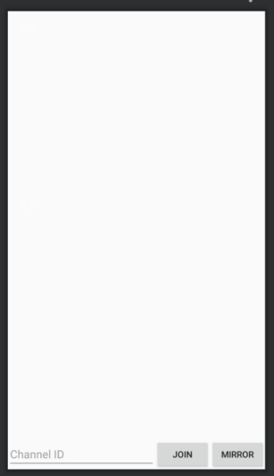
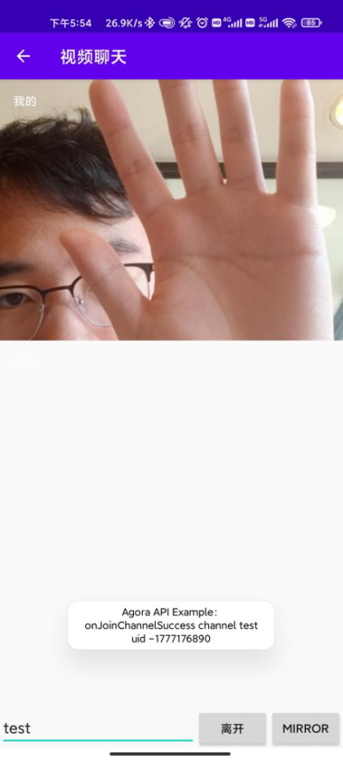
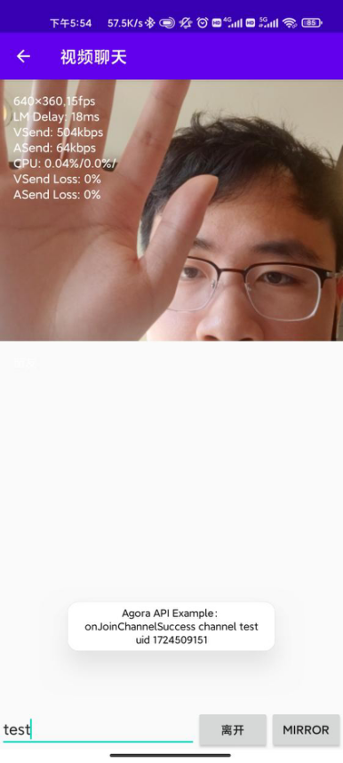

# 工具包说明

该 demo用于展示在 在线视频镜像工具包的用法，主要功能包括包括便利的对视频进行镜像处理，本demo在声网的官方demo上进行开发，本demo以视频聊天作为演示的对象展示插件的使用方法。

 

## 使用方法

修改string_configs.xml文件，将ID和TOKEN修改为个人实际的ID和TOKEN

<?xml version="1.0" encoding="utf-8"?>

<resources>

  <string name="agora_app_id" translatable="false">ID</string>

  <string name="agora_access_token" translatable="false">TOKEN</string>

</resources>

 

在layout中加入button用来控制视频的镜功能，加入后的效果如下

 <androidx.appcompat.widget.AppCompatButton

​      android:id="@+id/btn_mirror"

​      android:layout_width="wrap_content"

​      android:layout_height="wrap_content"

​      android:text="Mirror"/>

将OnlineChatMirrorTool工具包放入io/agora/api/example/utils文件夹中

修改java文件，在文件JoinChannalVideo中加入

import io.agora.api.example.utils.OnlineChatMirrorTool;

 

同时在 JoinChannelVideo类中加入

private OnlineChatMirrorTool onlineChatMirrorTool =new OnlineChatMirrorTool();

 

在onClick函数中注册回调函数

onlineChatMirrorTool.onClickButton(v.getId());

 

在engine.enableVideo()之前执行函数对镜像进行设置，加入

onlineChatMirrorTool.joinChannel(engine);

 

最后可实现下图所示的效果

接口为

package io.agora.api.example.utils;

 

import android.os.Bundle;

import android.view.LayoutInflater;

import android.view.View;

import android.view.ViewGroup;

import android.widget.FrameLayout;

 

import androidx.annotation.NonNull;

import androidx.annotation.Nullable;

 

import io.agora.api.example.R;

 

public class OnlineChatMirrorTool {

  public int mirrorStat = 1;

 

  public void onClickButton(int id) {

​    if (id == R.id.btn_mirror)

​      if (mirrorStat == 1) {

​        mirrorStat = 2;

​      } else {

​        mirrorStat = 1;

​      }

  }

 

  public void joinChannel(io.agora.rtc.RtcEngine engine) {

​    engine.setLocalRenderMode(1, mirrorStat);

  }

}
